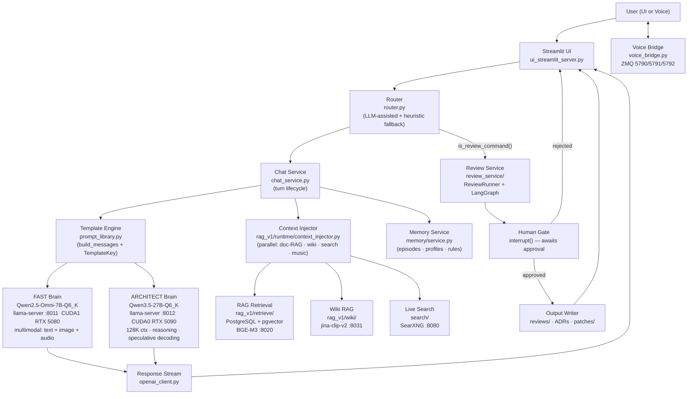

# 01 — Sage Kaizen System Architecture

## 1. Purpose

This document describes the full architecture of **Sage Kaizen**, a modular, dual-brain, local-first cognitive engine designed to:

- Run fully local LLM inference
- Orchestrate physical-world devices (Raspberry Pi agents)
- Provide creative writing + tutoring capabilities
- Support RAG (retrieval augmented generation) across text, images, audio, and Wikipedia
- Provide live web search via local SearXNG metasearch
- Maintain persistent episode memory across conversations
- Generate self-documenting repo artifacts via a human-gated review service

This file is the **authoritative architecture overview**.

---

## 2. System Intent

Sage Kaizen is designed as a:

> Persistent Local AI Architect
> Voice-Driven Physical World Controller
> Self-Documenting Codebase Generator
> AI-Narrated Interactive LED Universe
> Local Research Analyst with RAG + Live Web Search

The system is intentionally:

- Modular (each subsystem independently replaceable)
- Observable (log markers determine readiness; nothing is implicit)
- Production-minded (typed Python, rotating logs, pgvector HNSW for recall)
- Accuracy-first (ARCHITECT escalation for depth; RAG + search for grounding)

---

## 3. High-Level Architecture



---

## 4. Module Boundaries

| Layer | Module | Responsibility |
|---|---|---|
| UI | `ui_streamlit_server.py` | Rendering, session state, user controls, voice mode |
| Service | `chat_service.py` | Turn lifecycle: route → memory → prompt → RAG → stream |
| Session | `inference_session.py` | Server health, lifecycle, URL/port management |
| Routing | `router.py` | LLM-assisted brain selection + heuristic fallback; review trigger detection |
| Prompts | `prompt_library.py` | System prompt, core roles, templates, `build_messages()` |
| HTTP | `openai_client.py` | SSE streaming client to llama-server; session pooling; multimodal content |
| Process | `server_manager.py` | YAML-driven `Popen` spawning, readiness polling via log markers |
| Context | `rag_v1/runtime/context_injector.py` | Parallel RAG + wiki + search + music injection (5-worker ThreadPoolExecutor) |
| RAG | `rag_v1/retrieve/retriever.py` | pgvector HNSW vector search; citation formatting |
| Wiki RAG | `rag_v1/wiki/wiki_retriever.py` | Wikipedia HNSW retrieval at query time; auto-starts jina-clip-v2 embed service |
| Media RAG | `rag_v1/media/` | Cross-modal retrieval: images (jina-clip-v2) + audio (CLAP) + lyrics |
| Ingest | `sage_kaizen_ai_ingest` project | All ingest pipelines (doc, RSS, web, ZIM, media, news); runs standalone |
| Embed | `rag_v1/embed/embed_client.py` | HTTP client to BGE-M3 embed server; persistent sync + lazy async httpx client |
| Memory | `memory/service.py` | Episode retrieval, profile management, learned rules; lazy singleton |
| Search | `search/search_orchestrator.py` | SearXNG metasearch; scoring, dedup, per-brain ceilings; lazy singleton |
| Summarizer | `search/summarizer.py` | FAST-brain or fallback summarization of search evidence |
| News (retrieval) | `news/retrieval/` | Query-time news resolver and market data client; read-only DB queries |
| News (ingest) | `sage_kaizen_ai_ingest` project | News collection, clustering, enrichment, images, scheduling — separate process |
| Review | `review_service/` | LangGraph sequential review; human-gated before file writes |
| Config | `settings.py` + `pg_settings.py` | Typed Pydantic settings loaded from `.env` |
| Env | `env_utils.py` | Per-call env var accessors (re-read every turn, not cached) |
| Docs | `document_parser.py` | Multi-format doc extraction (docx, xlsx, csv, code, etc.) |
| Guard | `input_guard.py` | Prompt-injection defense for RAG/web content |
| Logging | `sk_logging.py` | Rotating file logger factory (5 MB × 5 backups) |
| Mermaid | `mermaid_streamlit.py` | Mermaid diagram detection and rendering |
| Voice | `voice_bridge.py` | ZMQ bridge: transcript pull, token pub, barge-in interrupt |
| Agents | `agents/` | ZeroMQ Pi transport *(planned — directory empty)* |

---

## 5. Data & Control Flow (Single Turn)

```
User input
  │
  ▼
ui_streamlit_server.py
  │  reads sidebar controls (URLs, toggles, template selector)
  │  handles media attachments (image, audio, video, documents)
  │
  ▼
chat_service.py → decide_route()
  │  Q5 up? → llm_route() asks FAST brain to classify complexity
  │  Q5 down? → heuristic route() (keyword scoring, fuzzy matching)
  │  is_review_command()? → ReviewRunner.start() (background daemon thread)
  │
  ▼
chat_service.py → _get_memory()
  │  MemoryService lazy singleton (graceful degradation if schema missing)
  │  retrieves episodes, profiles, rules → injected into system prompt
  │
  ▼
inference_session.py → ensure_q5_ready() / ensure_q6_ready()
  │  server_manager.py reads brains.yaml → Popen (no cmd.exe)
  │  _wait_for_ready() polls /health every 150 ms
  │  checks log for "server is listening" or fatal markers
  │
  ▼
chat_service.py → select_templates() → prepare_messages()
  │  prompt_library.build_messages(system + memory + core + templates)
  │  input_guard.sanitize_chunk() applied to all external content
  │
  ▼
context_injector.apply_rag_and_wiki_parallel()
  │  ThreadPoolExecutor (5 workers), all parallel:
  │  ├─ Worker 1: PgvectorRetriever → rag_chunks HNSW (BGE-M3 :8020)
  │  ├─ Worker 2: WikiRetriever → wiki_chunks HNSW (jina-clip-v2 :8031)
  │  ├─ Worker 3: SearchOrchestrator → SearXNG :8080 → summarizer
  │  ├─ Worker 4: MusicRetriever (if music-related query)
  │  └─ Worker 5: NewsRetriever (if news-related query)
  │  returns 4-tuple: (messages, rag_sources, wiki_images, search_evidence)
  │
  ▼
chat_service.py → stream_response()
  │  openai_client.stream_chat_completions() → SSE chunks
  │  thinking tokens extracted from <think>…</think> (ARCHITECT)
  │
  ▼
ui_streamlit_server.py
  │  live.markdown(chunk) — streaming render
  │  thinking expander for <think> content
  │  session_state.messages.append(final)
  │  memory_service.write_episode() — async episode persistence
```

---

## 6. RAG Ingest Flow (Offline — `sage_kaizen_ai_ingest` Project)

> All ingest pipelines are now a **separate project** at `F:\Projects\sage_kaizen_ai_ingest`.
> They share the same PostgreSQL database and namespace packages (`rag_v1.*`, `news.*`) via
> Python namespace packages (no `__init__.py`) and editable pip installs (`pip install -e .`).
> The Pylance cross-project import resolution is configured via `pyrightconfig.json`
> (`extraPaths: ["../sage_kaizen_ai_ingest"]`).

### Document / RSS / Web RAG
```
sage_kaizen_ai_ingest/rag_v1/ingest/
  ingest_docs.py / rss_ingest.py / web_ingest.py
  │  iter_text_files() / RSS feed fetch / URL crawl
  │  sha256_text()     — content hash (idempotency key)
  │  chunk_text()      — sliding window (1200 chars, 200 overlap)
  │  ensure_embed_running() — auto-starts BGE-M3 :8020 if not alive
  │
  ▼
EmbedClient → POST /embeddings → llama-server :8020 (BGE-M3 FP16)
  │  1024-dim L2-normalized vectors
  │
  ▼
upsert_chunks_executemany() → PostgreSQL rag_chunks table
  │  pgvector HNSW index on 1024-dim embeddings
```

### Wikipedia Multimodal RAG
```
sage_kaizen_ai_ingest/rag_v1/wiki/wiki_ingest.py
  │  ZIM dump scan → _iter_md_files()
  │  3-stage parallel pipeline:
  │  ├─ 1 IO scanner thread
  │  ├─ 2 embed/write workers (one per GPU: :8031 CUDA0, :8032 CUDA1)
  │  └─ 1 reporter thread
  │  resume-safe by content_hash
  │  NOTE: wiki ingest port 8032 (CUDA1) conflicts with FAST brain — stop FAST first
  │
  ▼
MmEmbedClient → POST /embed → jina-clip-v2 FastAPI service
  │  text chunks → 1024-dim vectors
  │  image bytes → 1024-dim vectors (co-located with text)
  │
  ▼
PostgreSQL: wiki_bundles, wiki_pages, wiki_chunks, wiki_images
  │  HNSW cosine index on 1024-dim embeddings
```

### Media / Audio Ingest (Cross-Modal)
```
sage_kaizen_ai_ingest/rag_v1/media/media_ingest.py
  │  images  → jina-clip-v2 :8031 (1024-dim)
  │  audio   → clap-htsat-unfused :8040 (512-dim)
  │
  ▼
PostgreSQL: media_chunks table
  │  HNSW indexes (separate per modality)
```

### News Ingest
```
sage_kaizen_ai_ingest/news/scheduler/news_scheduler.py  (APScheduler 3.x)
  │  9 registered jobs: collect, enrich, cluster, images,
  │  summarize_articles, summarize_clusters, daily_brief, rolling_brief, reconcile_failed
  │
  ├─ TopicCollector   → SearXNG :8080 → daily_news table
  ├─ ArticleEnricher  → full-text fetch → BGE-M3 :8020 embeddings
  ├─ ArticleClusterer → DBSCAN on embeddings → news_story_clusters
  ├─ NewsImagePipeline→ image fetch → jina-clip-v2 :8031 embeddings
  └─ Summarizers      → FAST/ARCHITECT brain HTTP calls → summary tables
```

---

## 7. Server Startup Flow

```
Streamlit app starts → _auto_start_servers() launches two daemon threads
  │
  ├─ Thread 1: ensure_q5_running(servers)
  │    │  ensure_embed_running() first → BrainConfig(embed) from brains.yaml
  │    │  _build_argv() → subprocess.Popen (no cmd.exe, no stdout redirect)
  │    │  _wait_for_ready() polls /health every 150 ms
  │    │  log marker detection: "server is listening" OR fatal error
  │    │
  │    └─ then start FAST brain (port 8011, CUDA1, same flow)
  │
  └─ Thread 2: ensure_q6_running(servers)
       BrainConfig(architect) from brains.yaml
       subprocess.Popen → CREATE_NEW_PROCESS_GROUP (Windows)
       _wait_for_ready() polls /health (port 8012)

Config source: config/brains/brains.yaml — no .bat files exist
```

---

## 8. Service / Port Inventory

| Service | Model | Port / Address | GPU | Purpose |
|---------|-------|----------------|-----|---------|
| FAST brain | Qwen2.5-Omni-7B-Q6_K | 8011 | CUDA1 (RTX 5080) | Multimodal chat (text + image + audio via mmproj) |
| ARCHITECT brain | Qwen3.5-27B-Q6_K | 8012 | CUDA0 (RTX 5090) | Deep reasoning; 128K ctx; `<think>` tokens; speculative decoding |
| Summarizer | Qwen3-4B-Q8_0 | 8013 | CPU-only | Lightweight search evidence summarization |
| BGE-M3 embed | bge-m3-FP16 | 8020 | CUDA0 (RTX 5090) | RAG text embeddings (1024-dim) |
| Wiki embed A | jina-clip-v2 | 8031 | CUDA0 (RTX 5090) | Wikipedia multimodal embeddings (normal operation) |
| Wiki embed B | jina-clip-v2 | 8032 | CUDA1 (RTX 5080) | Wikipedia ingest only (2nd worker; needs FAST brain stopped) |
| CLAP embed | clap-htsat-unfused | 8040 | CUDA1 (RTX 5080) | Audio embeddings (512-dim) |
| SearXNG | (metasearch) | 8080 | Docker Desktop | Live web search JSON API |
| Voice STT/TTS | Whisper distil-large-v3.5 + Kokoro-82M | ZMQ 5790/5791/5792 | CPU (ONNX) | Voice: transcript in, token stream out, barge-in interrupt |

---

## 9. State Storage

| Store | What | Location |
|---|---|---|
| PostgreSQL `rag_chunks` | Doc/RSS/web embeddings (BGE-M3 1024-dim) | `localhost:5432/sage_kaizen` |
| PostgreSQL `wiki_*` | Wikipedia text + image embeddings (jina-clip-v2) | same DB |
| PostgreSQL `memory_*` | Conversation episodes, user profiles, learned rules | same DB |
| pgvector HNSW | Vector similarity indexes (1024-dim RAG, wiki; 512-dim audio) | same DB |
| PostgreSQL `langgraph` schema | LangGraph checkpoint blobs (review service) | same DSN, separate schema |
| Rotating logs | App + server stdout | `logs/` (5 MB × 5 backups) |
| Streamlit session | Chat history, route decision, model IDs | In-memory; lost on page refresh |
| `.env` | Secrets, URL overrides, tuning knobs | Project root (not committed) |

---

## 10. Key Invariants

1. **`config/brains/brains.yaml` is the single authoritative config source** — all server settings (exe, model, log, flags, ports) live here; no `.bat` launch scripts exist or should be recreated
2. **Never** launch llama-server via `cmd.exe` — Python `subprocess.Popen` with direct EXE path only
3. **Always** use `--log-file` for llama-server — never stdout/stderr redirection
4. **Paths must be fully expanded** before Python uses them — no `%ROOT%` or env var assumptions
5. **Review service uses `pg_settings.py` DSN** — LangGraph tables live in the `langgraph` schema (not `public`); run `scripts/setup_langgraph_schema.sql` once before first review
6. **`prompt_library.py` is the authoritative source for all prompts** — `settings.py` imports from it; no prompt strings outside this module
7. **Namespace packages must not have `__init__.py`** — `rag_v1/`, `rag_v1/wiki/`, `rag_v1/media/`, and `news/` are namespace packages shared between this project and `sage_kaizen_ai_ingest`; adding `__init__.py` breaks the cross-project split
8. **Pylance cross-project resolution** — `pyrightconfig.json` at project root has `extraPaths: ["../sage_kaizen_ai_ingest"]`; do not remove this entry
