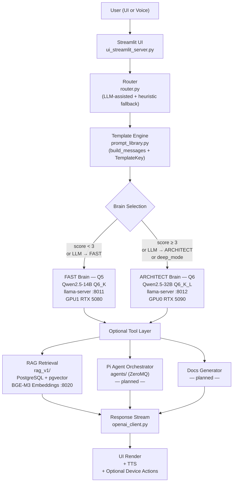

# 01-01 — Sage Kaizen System Architecture

## 1. Purpose

This document describes the full architecture of **Sage Kaizen**, a modular, dual-brain, local-first cognitive engine designed to:

- Run fully local LLM inference
- Orchestrate physical-world devices (Raspberry Pi agents)
- Provide creative writing + tutoring capabilities
- Support RAG (retrieval augmented generation)
- Generate self-documenting repo artifacts
- Scale modularly without architectural rewrites

This file is the **authoritative architecture overview**.

---

# 2. System Intent

Sage Kaizen is designed as a:

> Persistent Local AI Architect
> Voice-Driven Physical World Controller
> Self-Documenting Codebase Generator
> AI-Narrated Interactive LED Universe
> Local Research Analyst with RAG

The system is intentionally:

- Modular
- Observable
- Replaceable at module boundaries
- Production-minded
- Accuracy-first

---

# 3. High-Level Architecture

## Logical Flow



## Module Boundaries

| Layer | Module | Responsibility |
|---|---|---|
| UI | `ui_streamlit_server.py` | Rendering, session state, user controls |
| Service | `chat_service.py` | Turn lifecycle: route → prompt → RAG → stream |
| Session | `inference_session.py` | Server health, lifecycle, URL/port management |
| Routing | `router.py` | LLM-assisted brain selection + heuristic fallback |
| Prompts | `prompt_library.py` | System prompt, core roles, templates, `build_messages()` |
| HTTP | `openai_client.py` | SSE streaming client to llama-server |
| Process | `server_manager.py` | YAML-driven `Popen` spawning, readiness polling |
| RAG | `rag_v1/` | Ingest → embed → store → retrieve |
| Config | `settings.py` | Typed frozen dataclass, loaded from `.env` |
| Logging | `sk_logging.py` | Rotating file logger factory |
| Agents | `agents/` | ZeroMQ Pi transport *(planned)* |

---

# 4. Data & Control Flow (Single Turn)

```
User input
  │
  ▼
ui_streamlit_server.py
  │  reads sidebar controls (URLs, toggles, sliders)
  │
  ▼
chat_service.py → decide_route()
  │  Q5 up? → llm_route() asks FAST brain to classify complexity
  │  Q5 down? → heuristic route() (keyword scoring)
  │
  ▼
inference_session.py → ensure_q5_ready() / ensure_q6_ready()
  │  server_manager.py reads brains.yaml → Popen → polls log markers
  │
  ▼
chat_service.py → select_templates() → prepare_messages()
  │  prompt_library.build_messages(system + core + templates)
  │  router.apply_rag() → RagInjector → PgvectorRetriever
  │
  ▼
chat_service.py → stream_response()
  │  openai_client.stream_chat_completions() → SSE chunks
  │
  ▼
ui_streamlit_server.py
  │  live.markdown(chunk) — streaming render
  │  session_state.messages.append(final)
```

---

# 5. RAG Ingest Flow (Offline, Separate Process)

```
ingest_docs.py
  │  iter_text_files() — .md .txt .py .json .yaml
  │  sha256_text()     — content hash (idempotency)
  │  chunk_text()      — sliding window (1200 chars, 200 overlap)
  │
  ▼
EmbedClient → POST /embeddings → llama-server :8020 (BGE-M3 FP16)
  │
  ▼
upsert_chunks_executemany() → PostgreSQL rag_chunks table
  │  pgvector HNSW index on 1024-dim embeddings
```

---

# 6. Server Startup Flow

```
Streamlit app starts → _auto_start_servers() launches two daemon threads
  │
  ├─ Thread 1: ensure_q5_running(servers)
  │    │  ensure_embed_running() first → ManagedServers.from_yaml() → BrainConfig(embed)
  │    │  start_server_from_config() → _build_argv() → subprocess.Popen (no cmd.exe)
  │    │  _wait_for_ready() polls /health every 150ms
  │    │  checks log for "server is listening" or fatal markers
  │    │
  │    └─ then start Q5 (port 8011, same flow)
  │
  └─ Thread 2: ensure_q6_running(servers)
       ManagedServers.from_yaml() → BrainConfig(architect)
       start_server_from_config() → subprocess.Popen
       _wait_for_ready() polls /health (port 8012)

Config source: config/brains/brains.yaml (no .bat files)
```

---

# 7. State Storage

| Store | What | Location |
|---|---|---|
| PostgreSQL | RAG chunks + embeddings | `localhost:5432/sage_kaizen` |
| pgvector | 1024-dim HNSW index | `rag_chunks.embedding` column |
| Rotating logs | App + server stdout | `logs/` (5 MB × 5 backups) |
| Streamlit session | Chat history, route, model IDs | In-memory, lost on refresh |
| `.env` | Secrets + tuning knobs | Project root (not committed) |

Conversation persistence to PostgreSQL is **planned but not yet implemented**.

---

# 8. Key Invariants (from CLAUDE.md)

1. `.bat` files are **config only** — authoritative keys: `EXE=`, `MODEL=`
2. **Never** launch llama-server via `cmd.exe` / `cmd /c`
3. **Always** use `--log-file` for llama-server
4. Paths must be **fully expanded** before Python uses them
5. `prompt_library.py` Python strings are the **authoritative source** for all prompts
