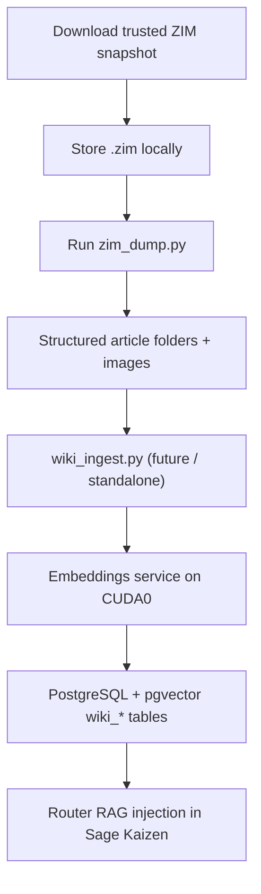

# 01-02 — Wikipedia Offline Corpus & ZIM Download Architecture

## 1. Purpose

This document describes how **Sage Kaizen** acquires, stores, extracts, and prepares offline Wikipedia content for retrieval-augmented generation (RAG), with a focus on the current `zim_dump.py` workflow and the English full-image corpus file:

- `wikipedia_en_all_maxi_2025-08.zim`

It is written to be:

- **Claude Code compatible**
- operational for humans
- aligned with the repository’s current implementation
- explicit about trusted download sources and verification paths

This file is intended to live alongside the architecture docs and act as the **authoritative Wikipedia acquisition + extraction reference** for the project.

---

# 2. Scope

This document covers:

1. Which Wikipedia offline artifact Sage Kaizen uses
2. Where to download it from trustworthy sources
3. How `zim_dump.py` currently extracts content
4. How the extracted corpus is organized on disk
5. How this data is expected to flow into Sage Kaizen RAG
6. Project rules and invariants for keeping the Wikipedia pipeline stable

It does **not** replace the broader system architecture document. It specializes it for the Wikipedia corpus pipeline.

---

# 3. Current Project Baseline

## Active target in the current repo

The current `zim_dump.py` job list includes:

- Download index: https://download.kiwix.org/zim/wikisource/
- `wikipedia_en_all_maxi_2025-08.zim`
- `wikipedia_en_all_nopic_2025-12.zim`
- `wikisource_en_all_maxi_2026-02.zim`
- `wikisource_en_all_nopic_2026-02.zim`

For the English Wikipedia full corpus with images, the current configured baseline is:

- **Input ZIM**
  - `C:\Users\Alquin\AppData\Roaming\kiwix-desktop\wikipedia_en_all_maxi_2025-08.zim`
- **Output root**
  - `I:\llm_data\wikipedia_maxi_2025_08`

This is taken directly from the current implementation in `zim_dump.py`.

## Important freshness note

As of **April 7, 2026**, the official Kiwix/Wikimedia mirror index shows that a newer full English Wikipedia ZIM exists:

- `wikipedia_en_all_maxi_2026-02.zim`

However, the project’s current extractor is still pinned to `wikipedia_en_all_maxi_2025-08.zim`. That is fine as long as the repo treats `2025-08` as the intentionally selected snapshot rather than the newest available one.

---

# 4. Why Sage Kaizen Uses ZIM

Sage Kaizen needs an offline, legally distributable, highly compressed, stable source of encyclopedic knowledge for local RAG. ZIM is the right format because it gives the project:

- a self-contained offline corpus
- deterministic snapshots
- compatibility with Kiwix and libzim
- full-text article bodies
- optional bundled media
- no dependency on live Wikipedia APIs during inference

Kiwix describes ZIM as the format used to package highly compressed offline web content, and Kiwix Reader is specifically intended to open ZIM files for offline browsing.

---

# 5. Trusted Download Sources

## Recommended trust order

When downloading `wikipedia_en_all_maxi_2025-08.zim`, use the following trust order:

### 1. Official Kiwix catalog / library
Primary discovery path for users.

- Kiwix FAQ says ZIM files are available through the Kiwix Reader built-in catalog or the official Kiwix library.
- This is the best **human-friendly** starting point.

Recommended discovery endpoints:

- `https://download.kiwix.org/zim/wikisource/`
- `https://library.kiwix.org/`
- `https://browse.library.kiwix.org/`
- Kiwix Reader built-in catalog

### 2. Official Kiwix download mirror tree
Primary direct-download location.

- `https://download.kiwix.org/zim/wikipedia/`

This is the most natural direct file-hosting path for scripted or manual download.

### 3. Wikimedia-hosted mirror of the Kiwix tree
Best for independently confirming the file exists, size, and timestamp.

- `https://dumps.wikimedia.org/other/kiwix/zim/wikipedia/`

This mirror is especially useful for validation because it exposes directory listings and timestamps.

### 4. OpenZIM / Zimfarm metadata
Useful for provenance and production context, not the first choice for the actual binary download.

- `https://farm.openzim.org/`
- `https://api.farm.openzim.org/`

Use this to cross-check that a given ZIM filename corresponds to a known build pipeline.

---

# 6. Exact File of Interest

## Canonical project file

- `wikipedia_en_all_maxi_2025-08.zim`

## What “maxi” means

Kiwix’s current FAQ defines the three Wikipedia flavors this way:

- `mini`: introduction + infobox only
- `nopic`: full articles, no images
- `maxi`: default full version

For Sage Kaizen, `maxi` matters because the project is explicitly moving toward **multimodal retrieval** and benefits from co-located image assets during extraction and downstream indexing.

## Why `2025-08` is still useful

Even though a newer `2026-02` full English snapshot exists, `2025-08` is still a strong corpus baseline because it is:

- already integrated into the current repo
- large and comprehensive
- compatible with the present output directory naming scheme
- stable for repeatable ingest experiments

---

# 7. Verified Availability of `wikipedia_en_all_maxi_2025-08.zim`

The file is currently visible in the Wikimedia-hosted Kiwix mirror listing with this metadata:

- filename: `wikipedia_en_all_maxi_2025-08.zim`
- modified: `24-Aug-2025 16:47`
- size: `119265903349` bytes

This is the strongest easy-to-audit public confirmation to include in the project docs because it is exposed by a major upstream mirror and can be inspected without relying on app UI behavior.

---

# 8. Recommended Download Methods

## Method A — Kiwix Reader (recommended for manual use)

Use Kiwix Reader when you want:

- the official catalog UX
- less manual path handling
- easier discovery of Wikipedia variants
- straightforward Windows workflows

Typical flow:

1. Install or open Kiwix Reader
2. Open the catalog/library
3. Search for `wikipedia_en_all_maxi_2025-08`
4. Download to the desired local store
5. Confirm the downloaded file path matches the path expected by `zim_dump.py`

This is the easiest path for one-off or interactive downloads.

## Method B — Direct HTTP download (recommended for scripted setups)

Use the direct file URL when you want:

- deterministic scripting
- external download managers
- checksum / size validation workflows
- easy automation outside the Kiwix UI

Expected file URL pattern:

```text
https://download.kiwix.org/zim/wikipedia/wikipedia_en_all_maxi_2025-08.zim
```

Mirror confirmation path:

```text
https://dumps.wikimedia.org/other/kiwix/zim/wikipedia/wikipedia_en_all_maxi_2025-08.zim
```

For this project, scripted acquisition is often the better fit because Sage Kaizen favors reproducible local pipelines.

## Method C — Mirror validation before use

Before treating a download as authoritative, verify:

- filename matches exactly
- size matches the mirror listing
- the file opens in Kiwix Reader or libzim
- `zim_dump.py` can read metadata via `archive.get_metadata("Date")`

---

# 9. Windows Placement Strategy for Sage Kaizen

## Current expected source path

```text
C:\Users\Alquin\AppData\Roaming\kiwix-desktop\wikipedia_en_all_maxi_2025-08.zim
```

## Recommendation

For long-term maintainability, keep one of these approaches consistent:

### Option A — Keep using the Kiwix Desktop download location
Pros:
- matches the current code
- simple for manual downloads

Cons:
- mixes application-managed content with project inputs
- can be less explicit for automation

### Option B — Move ZIM files into a dedicated data root
Example:

```text
I:\llm_data\zim\wikipedia_en_all_maxi_2025-08.zim
```

Pros:
- better separation of concerns
- easier to back up
- easier to version operational docs
- less coupled to Kiwix Desktop internals

Cons:
- requires updating `ZIM_JOBS`

**Project recommendation:** eventually migrate to a dedicated project-owned ZIM storage root, but do not change the code until the rest of the ingestion pipeline is ready to move with it.

---

# 10. `zim_dump.py` — Current Behavior Analysis

## What the script does

`zim_dump.py` extracts article text and referenced image files from a `.zim` archive into a structured local directory tree for later ingestion into Sage Kaizen RAG.

It is designed for very large ZIM files such as full Wikipedia snapshots.

## Current design strengths

### 10.1 Resume-safe extraction
The script skips any article folder that already exists, which makes it practical for very large multi-day dumps.

### 10.2 Windows long-path handling
The script deliberately uses extended-length Windows paths (`\\?\`) to avoid `MAX_PATH` failures during deep nested output writes.

### 10.3 Stable bucketing strategy
The output tree is bucketed as:

```text
<out_dir> / <FIRST_LETTER> / <first3chars> / <article_slug> /
```

Example:

```text
I:\llm_data\wikipedia_maxi_2025_08\
    A\
        alb\
            Albert_Einstein\
                Albert_Einstein_2025-08.md
                Einstein_1921_by_F_Schmutzer.jpg
```

This is a good design for Windows because it avoids pathological directory fanout.

### 10.4 HTML-first article detection
The extractor iterates all archive entries and keeps only non-redirect entries whose MIME type starts with `text/html`.

### 10.5 Article-body extraction
The script tries multiple MediaWiki-oriented XPath selectors such as:

- `mw-content-text`
- `mw-content-ltr`
- `mw-content-rtl`
- `bodyContent`
- `article`

This is a practical approach for Wikipedia/Wikisource snapshots with varying skins.

### 10.6 Markdown conversion
The main content HTML is converted to Markdown via `html2text`, with images ignored in Markdown because they are saved as separate files.

### 10.7 Image co-extraction
The extractor resolves image references in article HTML and attempts to save linked image entries if their MIME type is one of:

- JPEG
- PNG
- GIF
- WebP
- SVG
- BMP

That is exactly the right behavior for the project’s multimodal RAG direction.

---

# 11. Key Implementation Details from `zim_dump.py`

## Job configuration

`ZIM_JOBS` currently hard-codes ZIM→output mappings in Python. That is acceptable for the present stage, but it means the file is both:

- a tool
- a configuration source

For future hardening, these jobs should eventually move into YAML or `.env`-driven configuration.

## Metadata date extraction

`zim_date()` first tries:

```python
archive.get_metadata("Date")
```

and then falls back to older entry-based metadata paths:

- `M/Date`
- `Date`

This is good defensive design because it supports both modern and older ZIM metadata conventions.

## Iteration strategy

`iter_article_entries()` uses:

```python
archive._get_entry_by_id(i)
```

This is a private API on the Python bindings, but the script comments explain why it is used: it is the universal practical iteration path for libzim 3.x bindings.

That is a reasonable engineering choice, but it is still a **fragility point** because private APIs can change.

## Slugging strategy

The script normalizes Unicode, replaces Windows-illegal filename characters, collapses repeated underscores, strips trailing junk, and truncates slugs to 180 chars.

This is a strong baseline for Windows-safe article output.

## Error handling

The script:
- continues on per-entry failures
- logs up to the first 100 errors to stdout
- appends all failures to `_dump_errors.log`

That makes it suitable for long unattended runs.

---

# 12. Operational Limits and Risks

## 12.1 Private libzim iteration API
Using `_get_entry_by_id()` is practical but should be documented as a dependency risk.

## 12.2 Folder existence as the resume signal
If an article folder exists but is incomplete, the script skips it. That is fast, but it is a coarse checkpoint strategy.

Potential improvement:
- mark completion with a sentinel file such as `_complete.ok`

## 12.3 Image extraction is best-effort
Missing or inaccessible image paths are silently skipped. This is correct for robustness, but later stages should not assume every Markdown file has all referenced media.

## 12.4 Markdown conversion lossiness
`html2text` is appropriate for article text extraction, but tables, templates, and some citation structures can still degrade in conversion. That is acceptable for RAG, but should not be confused with archival-grade HTML preservation.

## 12.5 Hard-coded paths
Current paths are local-machine specific and should not remain the final project contract.

---

# 13. Recommended Invariants for Sage Kaizen

1. **Do not treat the Kiwix Desktop folder as the only valid long-term source root.**
2. **Keep the chosen Wikipedia snapshot explicit in code and docs.**
3. **When the project upgrades snapshots, update both the input ZIM path and the output root.**
4. **Do not silently swap `2025-08` for `2026-02` without re-baselining extraction and ingest.**
5. **Keep image extraction enabled for multimodal RAG variants.**
6. **Preserve the current bucketed output structure unless a migration plan is documented.**
7. **Document whether downstream RAG is indexing article Markdown only, images only, or both.**

---

# 14. Recommended Next-Step Architecture

## Near-term recommended flow



This matches the project direction already discussed:
- offline batch extraction first
- embeddings second
- normal RAG retrieval afterward

---

# 15. Claude Code Compatibility Notes

This file is intentionally structured for Claude Code to consume effectively.

Claude Code documentation emphasizes that the tool reads the codebase, works across multiple files, and benefits from strong documentation hygiene. Anthropic’s Claude Code docs map is itself organized hierarchically for LLM navigation, which is a useful model for repo docs.

## Rules used in this document

To keep this file useful to Claude Code and other coding agents, the document follows these principles:

- clear section hierarchy
- explicit filenames and paths
- direct operational recommendations
- stable terminology
- implementation notes separated from policy
- invariants written as short declarative rules
- code/file references written literally

## Recommended repo usage

Place this file near the existing architecture docs and reference it from:

- `README.md`
- `CLAUDE.md`
- `AGENTS.md`
- any future ingestion index document

Claude Code in VS Code also supports plan-first workflows around Markdown documents, so a file like this is a good place to anchor future tasks such as:
- upgrading to `wikipedia_en_all_maxi_2026-02.zim`
- introducing `wiki_ingest.py`
- moving ZIM job config into YAML
- adding verification scripts for corpus integrity

---

# 16. Download Checklist for `wikipedia_en_all_maxi_2025-08.zim`

Use this checklist before running extraction:

- [ ] Confirm the filename is exactly `wikipedia_en_all_maxi_2025-08.zim`
- [ ] Prefer Kiwix catalog/library discovery first
- [ ] Cross-check direct availability in the Wikimedia-hosted Kiwix mirror
- [ ] Confirm the reported size is `119265903349` bytes
- [ ] Store the file in the path expected by the current `ZIM_JOBS` config or update the config explicitly
- [ ] Verify the file opens in Kiwix Reader
- [ ] Verify `zim_dump.py` can read its metadata date
- [ ] Ensure the output drive has enough free space for extracted Markdown + images
- [ ] Keep the output root versioned by snapshot month

---

# 17. Recommended Project Placement

Recommended path inside the Sage Kaizen repo:

```text
docs/architecture/01-02-WIKIPEDIA.md
```

If the repo currently keeps architecture docs at the root, a temporary path is acceptable:

```text
Wikipedia.md
```

But long-term, the cleaner structure is to colocate it with `01-ARCHITECTURE.md`.

---

# 18. Source References

## Project-local sources reviewed

- `zim_dump.py`
- `01-ARCHITECTURE.md`

## External sources used for this document

### Kiwix / Kiwix Reader / Library
- Kiwix FAQ: `https://get.kiwix.org/en/faq/`
- Kiwix Reader: `https://get.kiwix.org/en/solutions/applications/kiwix-reader/`
- Kiwix Library: `https://library.kiwix.org/`
- Kiwix browse library: `https://browse.library.kiwix.org/`
- Kiwix download tree: `https://download.kiwix.org/zim/wikipedia/`

### Mirror / validation
- Wikimedia-hosted Kiwix mirror: `https://dumps.wikimedia.org/other/kiwix/zim/wikipedia/`

### OpenZIM / provenance
- Zimfarm UI: `https://farm.openzim.org/`
- Zimfarm API: `https://api.farm.openzim.org/`

### Claude Code documentation
- Claude Code overview: `https://code.claude.com/docs/en/overview`
- Claude Code best practices: `https://code.claude.com/docs/en/best-practices`
- Claude Code docs map: `https://code.claude.com/docs/en/claude_code_docs_map`
- Claude Code for VS Code: `https://code.claude.com/docs/en/vs-code`

---

# 19. Bottom Line

For Sage Kaizen, the current practical rule is:

> Download `wikipedia_en_all_maxi_2025-08.zim` from official Kiwix sources, validate it against the Wikimedia-hosted mirror listing, extract it with the existing `zim_dump.py` workflow, and treat the resulting directory tree as the stable offline Wikipedia corpus until the repo intentionally upgrades to a newer snapshot.

That keeps the project:

- local-first
- reproducible
- multimodal-ready
- compatible with current code
- ready for the next `wiki_ingest.py` stage
